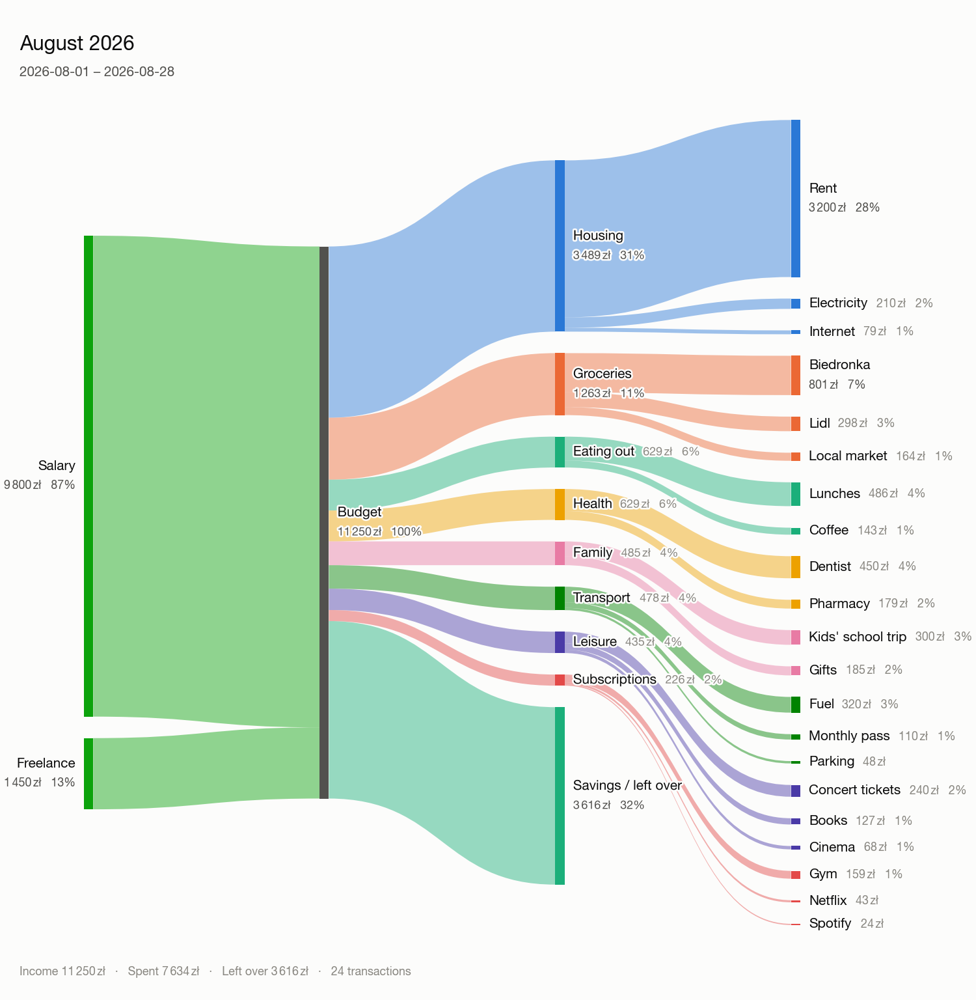
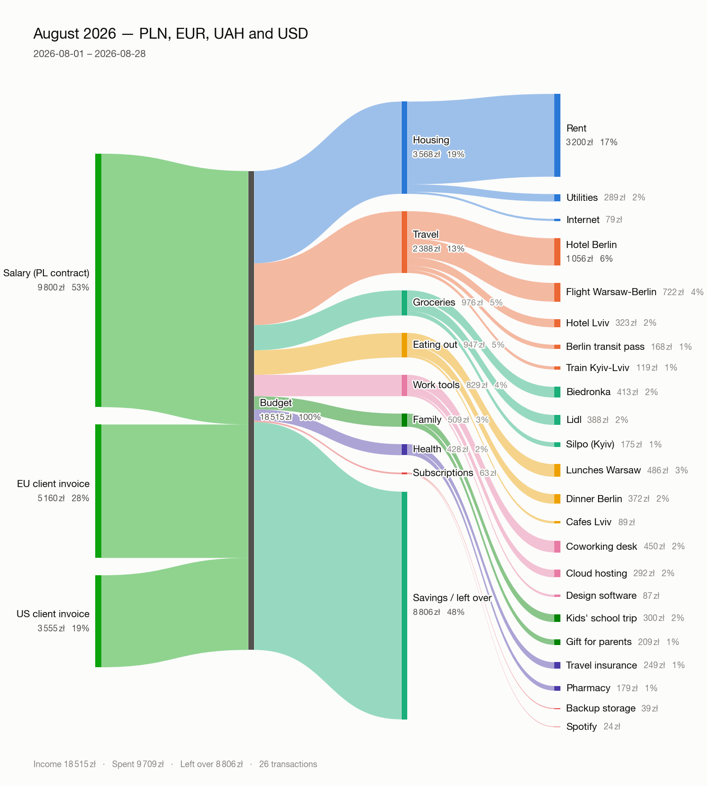
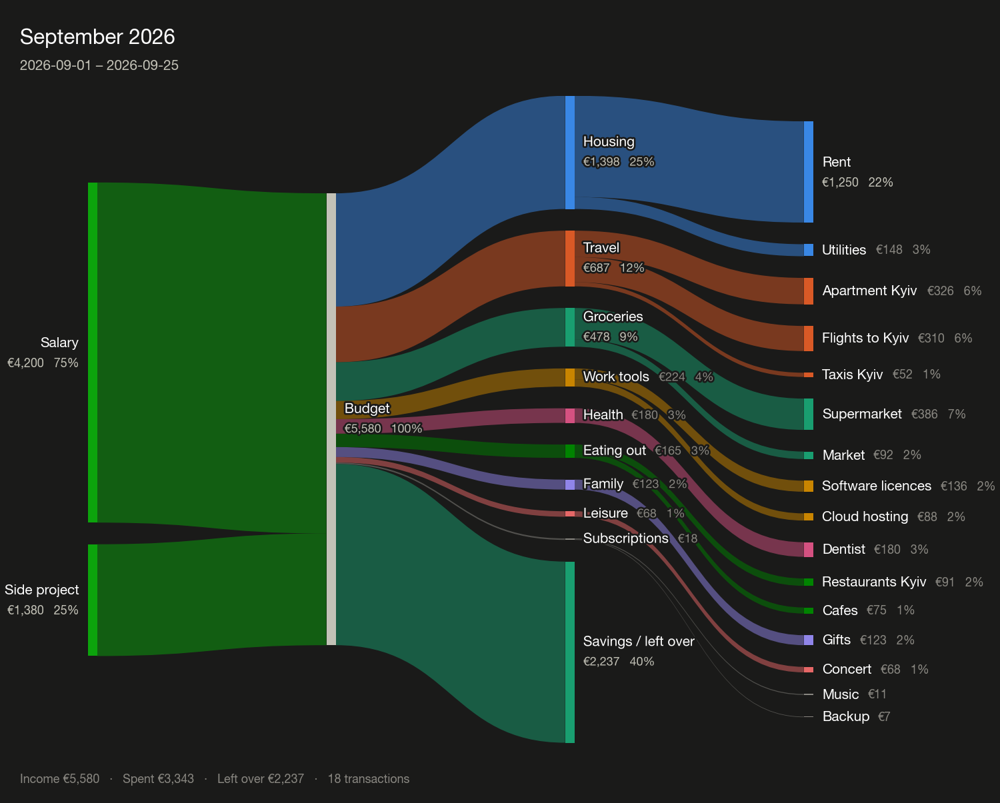

# visualize-my-expenses

Turn a month of budget rows into a Sankey diagram you can share as a PNG.

```bash
vme render budget.csv -c PLN -o august.png --month 2026-08
```



Money flows left to right: income sources → your budget → categories → what you
actually bought. Whatever you did not spend leaves as **Savings / left over**, so
the picture always balances.

---

## Install

The package is not on PyPI; install it from a clone.

```bash
git clone https://github.com/oskar-j/visualize-my-expenses
cd visualize-my-expenses
```

**uv**

```bash
uv sync                       # creates .venv and installs everything, dev tools included
uv run vme --help
```

**pip**

```bash
python -m venv .venv && source .venv/bin/activate
pip install -e .              # or: pip install -e ".[all]"
vme --help
```

Python 3.9 or newer. The core needs only `click` and `matplotlib` — no browser,
no headless Chrome, no network. Two optional extras:

| Extra | Adds | For |
|---|---|---|
| `.[excel]` | `openpyxl` | reading `.xlsx` workbooks |
| `.[html]` | `plotly` | writing an interactive `.html` version |
| `.[all]` | both | |

## Try it in 30 seconds

```bash
vme sample budget.csv                       # writes an example file
vme render budget.csv -c PLN -o august.png  # draws it
```

## Input formats

Point `vme` at whatever your bank or budget app exports; the format is guessed
from the file name, and `--format` overrides the guess.

| Format | Extensions | Notes |
|---|---|---|
| CSV / TSV | `.csv` `.tsv` `.txt` | separator and encoding are sniffed |
| JSON | `.json` | an array of rows, or `{"expenses": [...]}` |
| JSON Lines | `.jsonl` `.ndjson` | one row per line |
| OFX / QFX | `.ofx` `.qfx` | most US banks, Quicken, MS Money |
| QIF | `.qif` | older Quicken exports |
| ISO 20022 camt | `.xml` `.camt` | camt.052/053/054 SEPA statements |
| Excel | `.xlsx` `.xlsm` | needs the `excel` extra |

`vme formats` prints the same list.

Column names are matched loosely, so a bank export usually works untouched —
`Posted Date`, `Description`, `Transaction Amount`, `Debit/Credit`, `kwota` and
`waluta` are all understood. Amounts written as `1,234.56`, `1.234,56`,
`1 234,56`, `(12.00)`, `120.00-` or `$1,234.56` all parse.

The minimum a CSV needs is an amount:

```csv
date,category,label,amount,currency,kind
2026-08-01,Income,Salary,9800.00,PLN,income
2026-08-02,Housing,Rent,3200.00,PLN,expense
2026-08-04,Groceries,Biedronka,412.85,PLN,expense
```

`category` groups, `label` is the detail inside the group, `kind` is `income` or
`expense`. Leave `kind` out and the direction is inferred: if any amount is
negative the file is read as a bank statement (negative = money out); if none
is, every row is spending.

## Multiple currencies

Each row carries its own currency, and `-c/--currency` says which one the
*picture* is drawn in. Anything else needs a rate — one unit of that currency
expressed in the report currency:

```bash
vme render trip.csv -c PLN --rate EUR=4.30 --rate UAH=0.095 --rate USD=3.95
```



Rates can live in a file instead (`--rates rates.json`), as JSON or CSV:

```json
{ "base": "PLN", "rates": { "EUR": 4.30, "USD": 3.95, "UAH": 0.095 } }
```

```csv
currency,rate
EUR,4.30
UAH,0.095
```

A `--rate` flag overrides the same currency in the file. Rates are never fetched
from the internet: the same input has to draw the same picture next month, and a
rate that quietly changes between two runs would break that.

Around 50 currencies — including EUR, PLN, UAH, CZK, GBP, USD, JPY and BTC —
know their own symbol, decimal places and separators, so amounts are written the
way that currency is normally written (`1 234,50 zł`, `€1,234.50`, `¥1,235`).
Anything else still works and prints its ISO code. `vme currencies` lists them.

Forget a rate and the error tells you what to add:

```
error: rows are in EUR (Euro), UAH (Ukrainian hryvnia) but the report is in PLN.
Give a rate for each one, for example:  --rate EUR=4.30   (one EUR is worth 4.30 PLN)
```

## Command line

```
vme render   SOURCE   draw a Sankey diagram
vme summary  SOURCE   print the same breakdown as a table
vme check    SOURCE   report anything that would stop it being plotted
vme formats           list the input formats
vme currencies        list the known currencies
vme sample   FILE     write an example file to start from
```

Useful `render` options:

| Option | Does |
|---|---|
| `-o out.png` | `.png`, `.svg`, `.pdf` or `.html` — picked by extension |
| `-c PLN` | currency the report is drawn in |
| `-m 2026-08` | one month; also `-y 2026` and `-p START..END` |
| `--top 8` | keep the 8 biggest categories, fold the rest into "Other" |
| `--min-share 1` | fold anything under 1% of the total |
| `--max-labels 6` | most detail rows to show inside one category |
| `--no-detail` | stop at categories, skip the label column |
| `--theme dark` | dark background |
| `--width 1600 --dpi 200` | image size; height scales with the row count |
| `--transparent` | transparent background |
| `--sign statement` | force how a negative amount is read |
| `--open` | open the file when it is done |

Sharing a picture in a chat app: the defaults (1600px wide, 200 dpi, light
theme) are already sized for it. For a dark-mode chat, add `--theme dark`.



## Python API

`Visualizer` is the whole public surface.

```python
from vme import Visualizer

Visualizer.from_file("august.csv", currency="PLN").create_png("august.png")
```

Or build the rows yourself — dicts, namedtuples and `Expense` objects all work:

```python
from vme import Expense, Visualizer

rows = [
    Expense(category="Income",  label="Salary", amount=9800, currency="PLN", kind="income"),
    Expense(category="Housing", label="Rent",   amount=3200, currency="PLN"),
    Expense(category="Food",    label="Lidl",   amount=412,  currency="PLN"),
]

v = Visualizer(rows, currency="PLN", title="August 2026", theme="light")
v.print_to_console()
v.create_png("august.png", width=1600, dpi=200)
```

| Method | Does |
|---|---|
| `Visualizer.from_file(path, fmt=None, ...)` | read any supported file |
| `create_png(path)` | write a PNG (also `.svg`, `.pdf`) |
| `create_html(path)` | write an interactive plotly page — needs the `html` extra |
| `save(path)` | pick the writer from the extension |
| `show_plot()` | open an interactive window |
| `print_to_console()` | the breakdown as text |
| `graph()` | the `SankeyGraph`, if you want to draw it yourself |
| `problems()` | what is wrong with the rows, as a list |

Constructor arguments: `currency`, `rates`, `period`, `sign`, `title`,
`subtitle`, `theme`, `top_categories`, `max_labels`, `min_share`, `detail`,
`show_savings`, `group_income`, `verbose`.

Below `Visualizer` sit `vme.io` (loading), `vme.sankey` (rows → graph),
`vme.plotting` (graph → picture) and `vme.currencies`; each is usable on its own.

## Development

```bash
uv sync                 # or: pip install -e ".[all]" pytest ruff
uv run pytest           # 248 tests
uv run ruff check src tests
```

Layout:

```
src/vme/
  models.py       Expense, Node, Link, SankeyGraph
  currencies.py   currency metadata, formatting, rate files
  tools.py        amount/date/direction parsing, row coercion
  io/             one module per input format, self-registering
  data_store.py   row storage, sign conventions, conversion, validation
  sankey.py       rows -> graph (folding, savings branch)
  plotting.py     layout + the matplotlib and plotly backends
  theme.py        light and dark palettes
  cli.py          the click commands
```

The colour palettes are checked for colour-blind separation and for contrast
against their own background, and every node carries a visible label, so no
reading of the chart depends on telling two colours apart.

## Licence

MIT — see [LICENSE](LICENSE).
